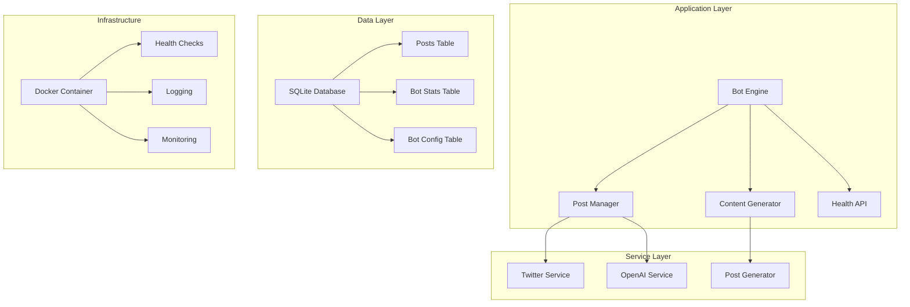

# System Architecture

The X.com Bot Template is a containerized, microservice-based system designed to run automated social media bots with unique personalities. The system is built with enterprise-grade reliability, monitoring, and security features.

## 🏗️ Architecture Overview

### Core Components



### System Design Principles

- **Modularity**: Each component has a single responsibility
- **Reliability**: Comprehensive error handling and recovery
- **Security**: Input validation, rate limiting, and secure API management
- **Observability**: Health monitoring, logging, and metrics
- **Scalability**: Containerized deployment with horizontal scaling capability

## 🔧 Technical Stack

### Core Technologies
- **Runtime**: Node.js 18+ with TypeScript
- **Database**: SQLite with automated backups
- **APIs**: Twitter API v2 (OAuth 1.0a), OpenAI GPT-4
- **Scheduling**: node-cron for automated posting
- **Containerization**: Docker with multi-stage builds

### Development Tools
- **Testing**: Jest with comprehensive test coverage
- **Linting**: ESLint with TypeScript support
- **Formatting**: Prettier for consistent code style
- **CI/CD**: GitHub Actions for automated testing and deployment

## 📊 Data Architecture

### Database Schema

```sql
-- Posts table for content management
CREATE TABLE posts (
  id INTEGER PRIMARY KEY,
  content TEXT NOT NULL,
  bot_id TEXT NOT NULL,
  category TEXT,
  used INTEGER DEFAULT 0,
  created_at TIMESTAMP DEFAULT CURRENT_TIMESTAMP,
  updated_at TIMESTAMP DEFAULT CURRENT_TIMESTAMP,
  generation_cost REAL,
  generation_tokens INTEGER,
  generation_model TEXT,
  content_hash TEXT UNIQUE
);

-- Bot statistics tracking
CREATE TABLE bot_stats (
  bot_id TEXT PRIMARY KEY,
  total_posts INTEGER DEFAULT 0,
  remaining_posts INTEGER DEFAULT 0,
  last_post_at TIMESTAMP,
  last_replenishment_at TIMESTAMP,
  created_at TIMESTAMP DEFAULT CURRENT_TIMESTAMP,
  updated_at TIMESTAMP DEFAULT CURRENT_TIMESTAMP
);

-- Bot configuration storage
CREATE TABLE bot_configs (
  bot_id TEXT PRIMARY KEY,
  personality_prompt TEXT,
  content_sources TEXT,
  posting_style TEXT,
  topics TEXT,
  tone TEXT,
  max_length INTEGER,
  schedule_cron TEXT,
  timezone TEXT,
  created_at TIMESTAMP DEFAULT CURRENT_TIMESTAMP,
  updated_at TIMESTAMP DEFAULT CURRENT_TIMESTAMP
);
```

### Data Flow

1. **Content Generation**: AI-powered content creation with topic variety
2. **Content Storage**: Posts stored in SQLite with deduplication
3. **Content Retrieval**: Scheduled posting with rotation through topics
4. **Content Tracking**: Usage statistics and performance metrics

## 🔒 Security Architecture

### Security Layers

1. **API Security**: OAuth 1.0a for Twitter, API keys for OpenAI
2. **Input Validation**: Zod schemas for all inputs
3. **Rate Limiting**: Built-in rate limiting to prevent abuse
4. **Container Security**: Non-root execution and minimal attack surface
5. **Network Security**: Localhost-only health endpoints

### Security Features

- **Environment Variables**: Secure credential management
- **Input Sanitization**: All inputs validated and sanitized
- **Error Handling**: Secure error messages without information leakage
- **Logging**: Comprehensive security event logging
- **Monitoring**: Real-time security monitoring and alerting

## 📈 Performance Architecture

### Optimization Strategies

1. **Database Optimization**: Indexed queries and connection pooling
2. **Content Caching**: In-memory caching for frequently accessed content
3. **Batch Processing**: Efficient bulk operations for content generation
4. **Resource Management**: Memory and CPU optimization

### Performance Metrics

- **Response Time**: < 500ms for health checks
- **Memory Usage**: < 512MB per container
- **CPU Usage**: < 50% average utilization
- **Post Success Rate**: > 99% success rate

## 🔄 Deployment Architecture

### Container Strategy

```yaml
services:
  template-bot:
    build:
      context: ./app/app-agent-xcom-template
      dockerfile: Dockerfile
    container_name: template-bot
    environment:
      - NODE_ENV=production
      - BOT_NAME=template-bot
    volumes:
      - ./data:/app/data
      - ./logs:/app/logs
    healthcheck:
      test: ["CMD", "curl", "-f", "http://localhost:3000/health"]
      interval: 30s
      timeout: 10s
      retries: 3
```

### Health Monitoring

- **Health Checks**: Automated health monitoring
- **Metrics Collection**: Performance and usage metrics
- **Alerting**: Proactive issue detection and notification
- **Logging**: Structured logging with log rotation

## 🚀 Scalability Considerations

### Horizontal Scaling

- **Stateless Design**: Bot instances can be scaled horizontally
- **Database Sharing**: Multiple instances can share the same database
- **Load Balancing**: Support for load balancer configuration
- **Auto-scaling**: Kubernetes deployment ready

### Vertical Scaling

- **Resource Limits**: Configurable CPU and memory limits
- **Performance Tuning**: Database and application optimization
- **Caching**: Multi-level caching strategies
- **Connection Pooling**: Efficient database connection management

## 🔧 Configuration Management

### Environment Variables

```bash
# Bot Configuration
BOT_NAME=template-bot
BOT_PERSONALITY=Customizable bot personality
POSTING_SCHEDULE=0 9 * * *

# API Configuration
TWITTER_API_KEY=your_twitter_api_key
TWITTER_API_SECRET=your_twitter_api_secret
TWITTER_ACCESS_TOKEN=your_access_token
TWITTER_ACCESS_SECRET=your_access_secret
OPENAI_API_KEY=your_openai_api_key

# Database Configuration
DATABASE_PATH=./data/template-bot.db

# Security Configuration
HEALTH_CHECK_PORT=3000
API_RATE_LIMIT=100
```

### Configuration Validation

- **Schema Validation**: All configuration validated with Zod
- **Required Fields**: Clear error messages for missing configuration
- **Default Values**: Sensible defaults for optional configuration
- **Environment-Specific**: Different configurations for dev/prod

## 📊 Monitoring and Observability

### Health Monitoring

- **Health Endpoints**: RESTful API for health checks
- **Metrics Collection**: Performance and usage metrics
- **Logging**: Structured logging with multiple levels
- **Alerting**: Proactive issue detection

### Observability Features

- **Request Tracing**: End-to-end request tracing
- **Performance Monitoring**: Response time and throughput metrics
- **Error Tracking**: Comprehensive error tracking and reporting
- **Usage Analytics**: Bot usage and performance analytics

---

**Ready to deploy your bot?** 🚀

This architecture provides a solid foundation for building scalable, reliable, and secure X.com bots.
