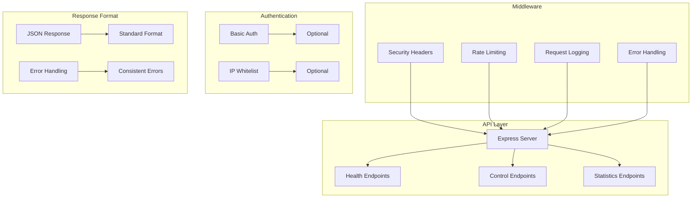

# API Architecture

```mermaid
graph TB
    subgraph "API Layer"
        A[Express Server] --> B[Health Endpoints]
        A --> C[Control Endpoints]
        A --> D[Statistics Endpoints]
    end
    
    subgraph "Middleware"
        E[Security Headers] --> A
        F[Rate Limiting] --> A
        G[Request Logging] --> A
        H[Error Handling] --> A
    end
    
    subgraph "Authentication"
        I[Basic Auth] --> J[Optional]
        K[IP Whitelist] --> L[Optional]
    end
    
    subgraph "Response Format"
        M[JSON Response] --> N[Standard Format]
        O[Error Handling] --> P[Consistent Errors]
    end
```
