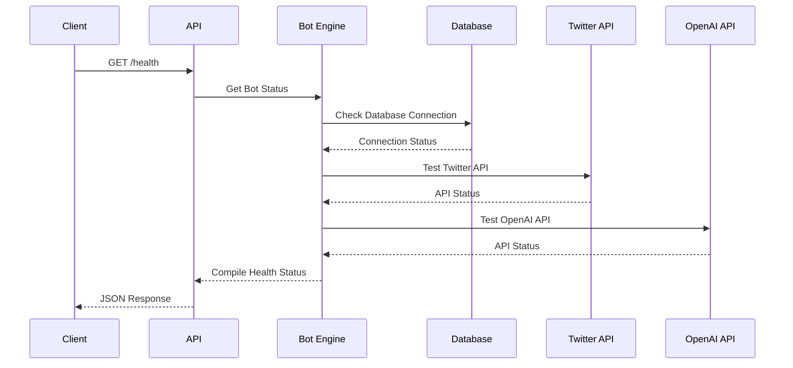

# API Health Check Flow

```mermaid
sequenceDiagram
    participant C as Client
    participant A as API
    participant B as Bot Engine
    participant D as Database
    participant T as Twitter API
    participant O as OpenAI API
    
    C->>A: GET /health
    A->>B: Get Bot Status
    B->>D: Check Database Connection
    D-->>B: Connection Status
    B->>T: Test Twitter API
    T-->>B: API Status
    B->>O: Test OpenAI API
    O-->>B: API Status
    B-->>A: Compile Health Status
    A-->>C: JSON Response
```
