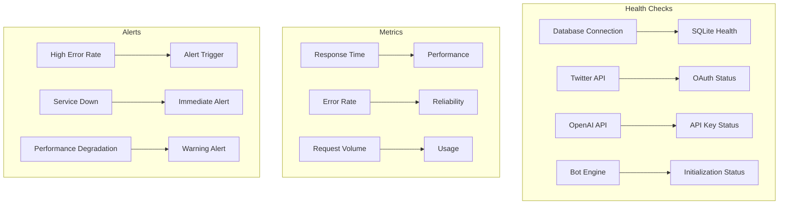

# API Health Monitoring

```mermaid
graph TB
    subgraph "Health Checks"
        A[Database Connection] --> B[SQLite Health]
        C[Twitter API] --> D[OAuth Status]
        E[OpenAI API] --> F[API Key Status]
        G[Bot Engine] --> H[Initialization Status]
    end
    
    subgraph "Metrics"
        I[Response Time] --> J[Performance]
        K[Error Rate] --> L[Reliability]
        M[Request Volume] --> N[Usage]
    end
    
    subgraph "Alerts"
        O[High Error Rate] --> P[Alert Trigger]
        Q[Service Down] --> R[Immediate Alert]
        S[Performance Degradation] --> T[Warning Alert]
    end
```
