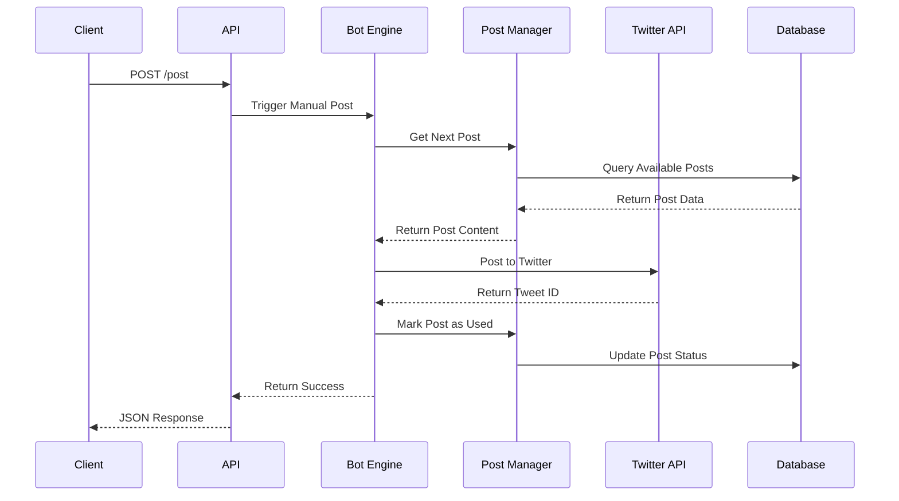

# API Manual Post Flow

```mermaid
sequenceDiagram
    participant C as Client
    participant A as API
    participant B as Bot Engine
    participant P as Post Manager
    participant T as Twitter API
    participant D as Database
    
    C->>A: POST /post
    A->>B: Trigger Manual Post
    B->>P: Get Next Post
    P->>D: Query Available Posts
    D-->>P: Return Post Data
    P-->>B: Return Post Content
    B->>T: Post to Twitter
    T-->>B: Return Tweet ID
    B->>P: Mark Post as Used
    P->>D: Update Post Status
    B-->>A: Return Success
    A-->>C: JSON Response
```
