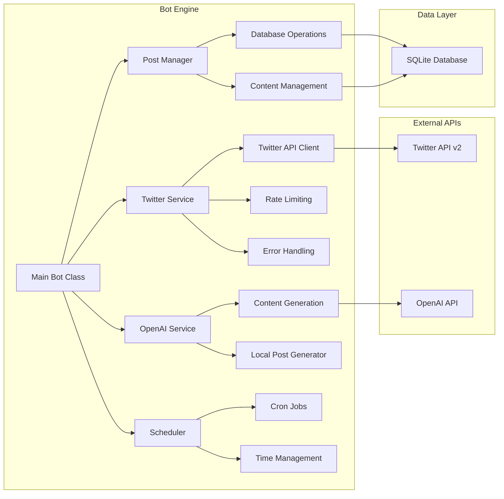

# Bot Engine Architecture

```mermaid
graph LR
    subgraph "Bot Engine"
        A[Main Bot Class] --> B[Post Manager]
        A --> C[Twitter Service]
        A --> D[OpenAI Service]
        A --> E[Scheduler]
        
        B --> F[Database Operations]
        B --> G[Content Management]
        
        C --> H[Twitter API Client]
        C --> I[Rate Limiting]
        C --> J[Error Handling]
        
        D --> K[Content Generation]
        D --> L[Local Post Generator]
        
        E --> M[Cron Jobs]
        E --> N[Time Management]
    end
    
    subgraph "Data Layer"
        F --> O[SQLite Database]
        G --> O
    end
    
    subgraph "External APIs"
        H --> P[Twitter API v2]
        K --> Q[OpenAI API]
    end
```
