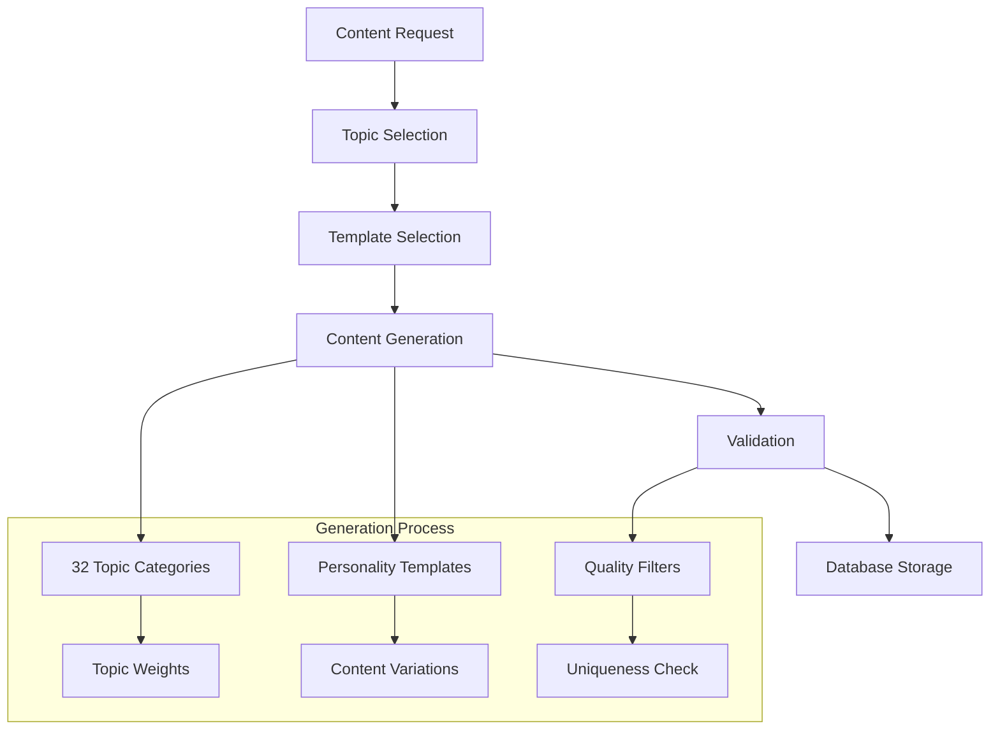

# Content Generation System

```mermaid
graph TB
    A[Content Request] --> B[Topic Selection]
    B --> C[Template Selection]
    C --> D[Content Generation]
    D --> E[Validation]
    E --> F[Database Storage]
    
    subgraph "Generation Process"
        G[32 Topic Categories] --> H[Topic Weights]
        I[Personality Templates] --> J[Content Variations]
        K[Quality Filters] --> L[Uniqueness Check]
    end
    
    D --> G
    D --> I
    E --> K
```
