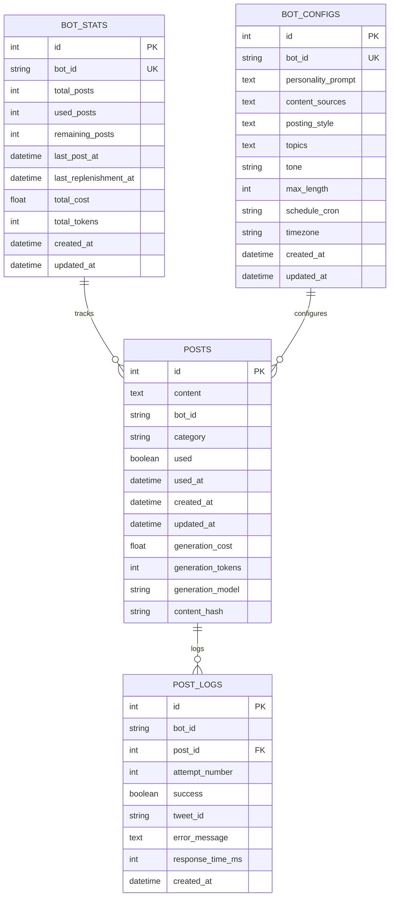

# Database Schema

```mermaid
erDiagram
    POSTS {
        int id PK
        text content
        string bot_id
        string category
        boolean used
        datetime used_at
        datetime created_at
        datetime updated_at
        float generation_cost
        int generation_tokens
        string generation_model
        string content_hash
    }
    
    BOT_STATS {
        int id PK
        string bot_id UK
        int total_posts
        int used_posts
        int remaining_posts
        datetime last_post_at
        datetime last_replenishment_at
        float total_cost
        int total_tokens
        datetime created_at
        datetime updated_at
    }
    
    POST_LOGS {
        int id PK
        string bot_id
        int post_id FK
        int attempt_number
        boolean success
        string tweet_id
        text error_message
        int response_time_ms
        datetime created_at
    }
    
    BOT_CONFIGS {
        int id PK
        string bot_id UK
        text personality_prompt
        text content_sources
        text posting_style
        text topics
        string tone
        int max_length
        string schedule_cron
        string timezone
        datetime created_at
        datetime updated_at
    }
    
    POSTS ||--o{ POST_LOGS : "logs"
    BOT_STATS ||--o{ POSTS : "tracks"
    BOT_CONFIGS ||--o{ POSTS : "configures"
```
