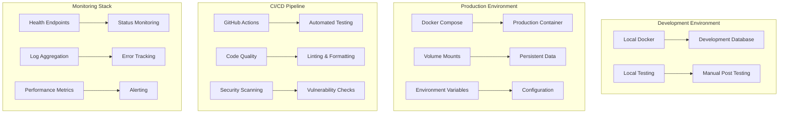

# Deployment Architecture

```mermaid
graph TB
    subgraph "Development Environment"
        A[Local Docker] --> B[Development Database]
        C[Local Testing] --> D[Manual Post Testing]
    end
    
    subgraph "Production Environment"
        E[Docker Compose] --> F[Production Container]
        G[Volume Mounts] --> H[Persistent Data]
        I[Environment Variables] --> J[Configuration]
    end
    
    subgraph "CI/CD Pipeline"
        K[GitHub Actions] --> L[Automated Testing]
        M[Code Quality] --> N[Linting & Formatting]
        O[Security Scanning] --> P[Vulnerability Checks]
    end
    
    subgraph "Monitoring Stack"
        Q[Health Endpoints] --> R[Status Monitoring]
        S[Log Aggregation] --> T[Error Tracking]
        U[Performance Metrics] --> V[Alerting]
    end
```
