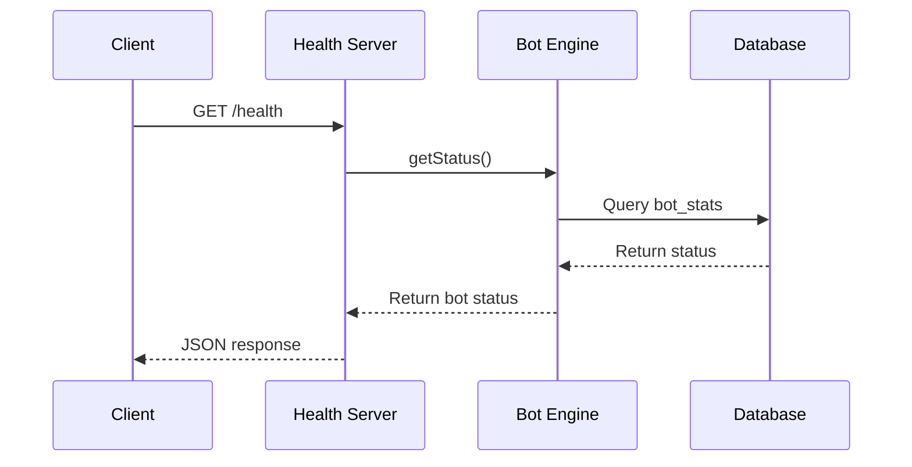

# Development API Flow

```mermaid
sequenceDiagram
    participant C as Client
    participant H as Health Server
    participant B as Bot Engine
    participant D as Database
    
    C->>H: GET /health
    H->>B: getStatus()
    B->>D: Query bot_stats
    D-->>B: Return status
    B-->>H: Return bot status
    H-->>C: JSON response
```
