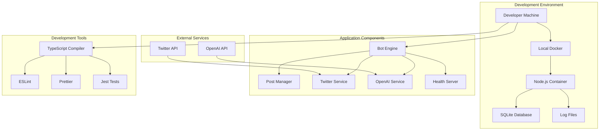

# Development Architecture

```mermaid
graph TB
    subgraph "Development Environment"
        A[Developer Machine] --> B[Local Docker]
        B --> C[Node.js Container]
        C --> D[SQLite Database]
        C --> E[Log Files]
    end
    
    subgraph "Application Components"
        F[Bot Engine] --> G[Post Manager]
        F --> H[Twitter Service]
        F --> I[OpenAI Service]
        F --> J[Health Server]
    end
    
    subgraph "External Services"
        K[Twitter API] --> H
        L[OpenAI API] --> I
    end
    
    subgraph "Development Tools"
        M[TypeScript Compiler] --> N[ESLint]
        M --> O[Prettier]
        M --> P[Jest Tests]
    end
    
    A --> F
    A --> M
```
