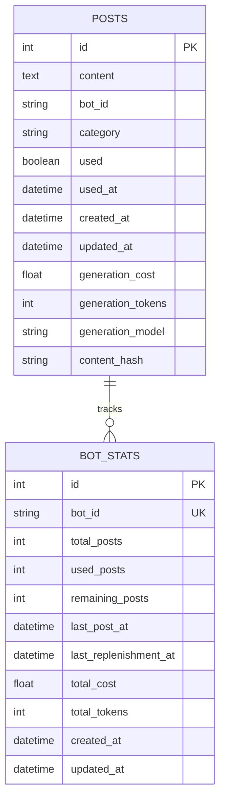

# Development Database Schema

```mermaid
erDiagram
    POSTS {
        int id PK
        text content
        string bot_id
        string category
        boolean used
        datetime used_at
        datetime created_at
        datetime updated_at
        float generation_cost
        int generation_tokens
        string generation_model
        string content_hash
    }
    
    BOT_STATS {
        int id PK
        string bot_id UK
        int total_posts
        int used_posts
        int remaining_posts
        datetime last_post_at
        datetime last_replenishment_at
        float total_cost
        int total_tokens
        datetime created_at
        datetime updated_at
    }
    
    POSTS ||--o{ BOT_STATS : "tracks"
```
