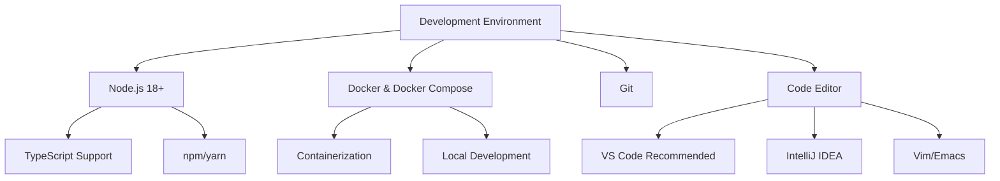

# Development Environment

```mermaid
graph TB
    A[Development Environment] --> B[Node.js 18+]
    A --> C[Docker & Docker Compose]
    A --> D[Git]
    A --> E[Code Editor]
    
    B --> F[TypeScript Support]
    B --> G[npm/yarn]
    
    C --> H[Containerization]
    C --> I[Local Development]
    
    E --> J[VS Code Recommended]
    E --> K[IntelliJ IDEA]
    E --> L[Vim/Emacs]
```
