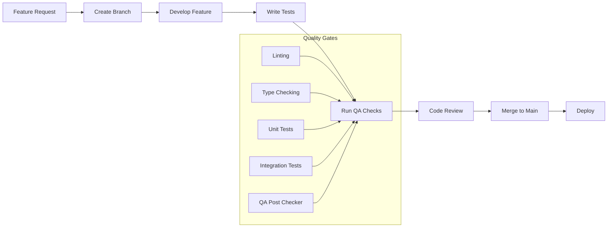

# Development Workflow

```mermaid
graph LR
    A[Feature Request] --> B[Create Branch]
    B --> C[Develop Feature]
    C --> D[Write Tests]
    D --> E[Run QA Checks]
    E --> F[Code Review]
    F --> G[Merge to Main]
    G --> H[Deploy]
    
    subgraph "Quality Gates"
        I[Linting] --> E
        J[Type Checking] --> E
        K[Unit Tests] --> E
        L[Integration Tests] --> E
        M[QA Post Checker] --> E
    end
```
