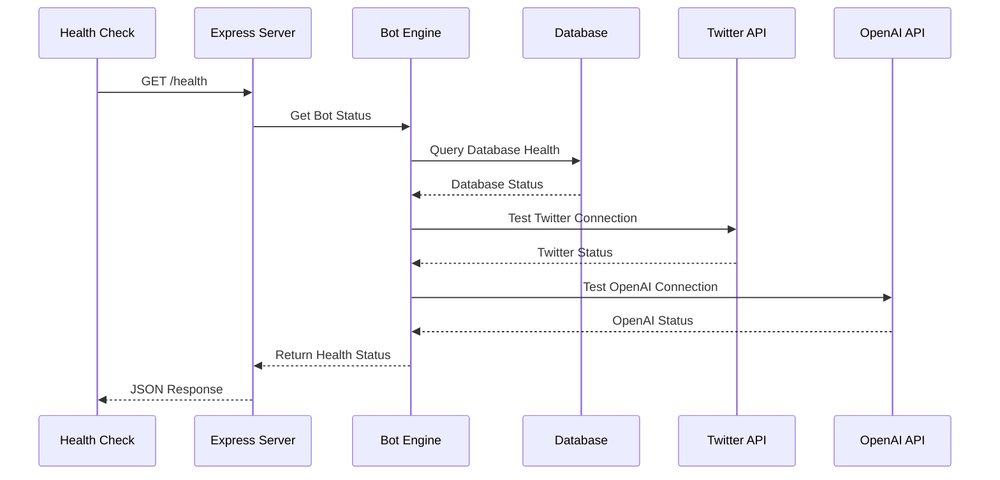

# Health Monitoring Flow

```mermaid
sequenceDiagram
    participant H as Health Check
    participant E as Express Server
    participant B as Bot Engine
    participant D as Database
    participant T as Twitter API
    participant O as OpenAI API
    
    H->>E: GET /health
    E->>B: Get Bot Status
    B->>D: Query Database Health
    D-->>B: Database Status
    B->>T: Test Twitter Connection
    T-->>B: Twitter Status
    B->>O: Test OpenAI Connection
    O-->>B: OpenAI Status
    B-->>E: Return Health Status
    E-->>H: JSON Response
```
