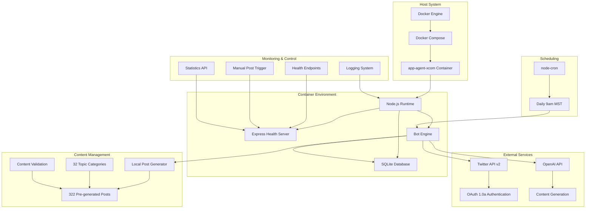

# High-Level Architecture

```mermaid
graph TB
    subgraph "Host System"
        A[Docker Engine] --> B[Docker Compose]
        B --> C[app-agent-xcom Container]
    end
    
    subgraph "Container Environment"
        C --> D[Node.js Runtime]
        D --> E[Express Health Server]
        D --> F[Bot Engine]
        D --> G[SQLite Database]
    end
    
    subgraph "External Services"
        H[Twitter API v2] --> I[OAuth 1.0a Authentication]
        J[OpenAI API] --> K[Content Generation]
    end
    
    subgraph "Monitoring & Control"
        L[Health Endpoints] --> E
        M[Manual Post Trigger] --> E
        N[Statistics API] --> E
        O[Logging System] --> D
    end
    
    subgraph "Content Management"
        P[Local Post Generator] --> Q[322 Pre-generated Posts]
        R[32 Topic Categories] --> Q
        S[Content Validation] --> Q
    end
    
    subgraph "Scheduling"
        T[node-cron] --> U[Daily 9am MST]
        U --> F
    end
    
    F --> H
    F --> J
    F --> P
    F --> G
```
