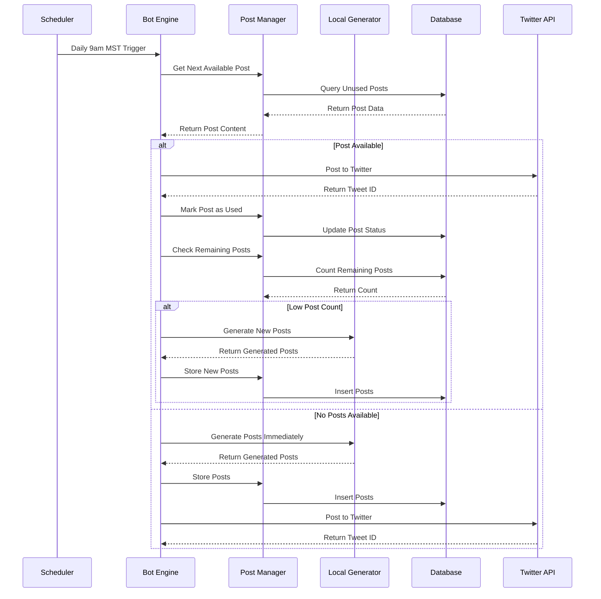

# Post Generation Flow

```mermaid
sequenceDiagram
    participant S as Scheduler
    participant B as Bot Engine
    participant P as Post Manager
    participant G as Local Generator
    participant D as Database
    participant T as Twitter API
    
    S->>B: Daily 9am MST Trigger
    B->>P: Get Next Available Post
    P->>D: Query Unused Posts
    D-->>P: Return Post Data
    P-->>B: Return Post Content
    
    alt Post Available
        B->>T: Post to Twitter
        T-->>B: Return Tweet ID
        B->>P: Mark Post as Used
        P->>D: Update Post Status
        B->>P: Check Remaining Posts
        P->>D: Count Remaining Posts
        D-->>P: Return Count
        
        alt Low Post Count
            B->>G: Generate New Posts
            G-->>B: Return Generated Posts
            B->>P: Store New Posts
            P->>D: Insert Posts
        end
    else No Posts Available
        B->>G: Generate Posts Immediately
        G-->>B: Return Generated Posts
        B->>P: Store Posts
        P->>D: Insert Posts
        B->>T: Post to Twitter
        T-->>B: Return Tweet ID
    end
```
