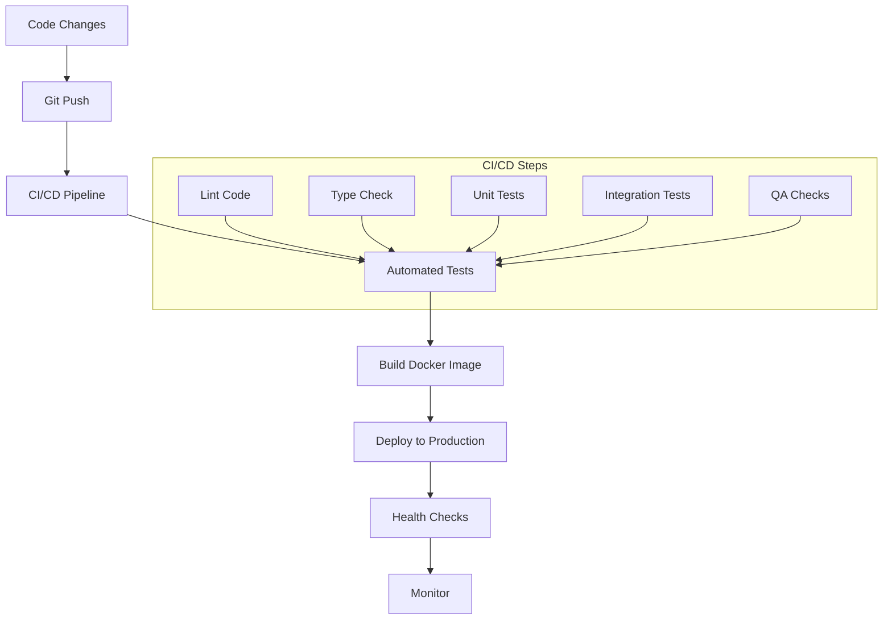

# Production Deployment

```mermaid
graph TB
    A[Code Changes] --> B[Git Push]
    B --> C[CI/CD Pipeline]
    C --> D[Automated Tests]
    D --> E[Build Docker Image]
    E --> F[Deploy to Production]
    F --> G[Health Checks]
    G --> H[Monitor]
    
    subgraph "CI/CD Steps"
        I[Lint Code] --> D
        J[Type Check] --> D
        K[Unit Tests] --> D
        L[Integration Tests] --> D
        M[QA Checks] --> D
    end
```
