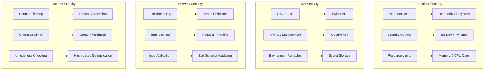

# Security Architecture

```mermaid
graph TB
    subgraph "Container Security"
        A[Non-root User] --> B[Read-only Filesystem]
        C[Security Options] --> D[No New Privileges]
        E[Resource Limits] --> F[Memory & CPU Caps]
    end
    
    subgraph "API Security"
        G[OAuth 1.0a] --> H[Twitter API]
        I[API Key Management] --> J[OpenAI API]
        K[Environment Variables] --> L[Secret Storage]
    end
    
    subgraph "Network Security"
        M[Localhost Only] --> N[Health Endpoints]
        O[Rate Limiting] --> P[Request Throttling]
        Q[Input Validation] --> R[Zod Schema Validation]
    end
    
    subgraph "Content Security"
        S[Content Filtering] --> T[Profanity Detection]
        U[Character Limits] --> V[Content Validation]
        W[Uniqueness Checking] --> X[Hash-based Deduplication]
    end
```
