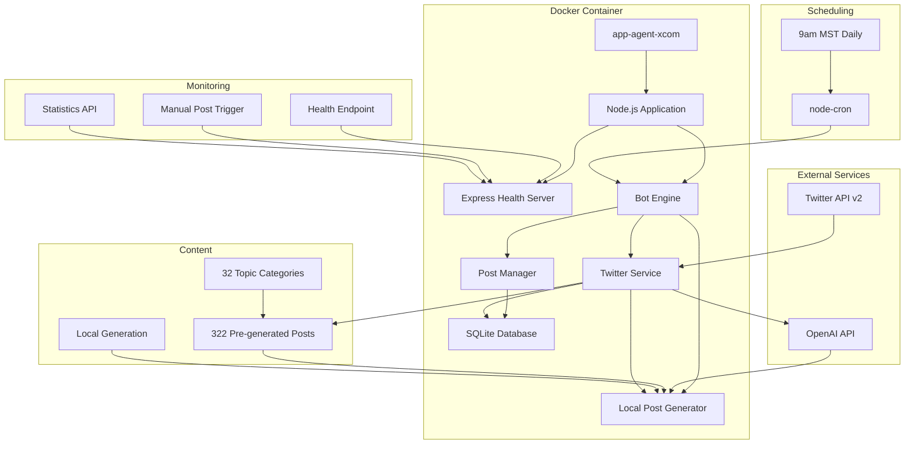

# System Architecture

```mermaid
graph TB
    subgraph "Docker Container"
        A[app-agent-xcom] --> B[Node.js Application]
        B --> C[Express Health Server]
        B --> D[Bot Engine]
        D --> E[Post Manager]
        D --> F[Twitter Service]
        D --> G[Local Post Generator]
        E --> H[SQLite Database]
    end
    
    subgraph "External Services"
        I[Twitter API v2] --> F
        J[OpenAI API] --> G
    end
    
    subgraph "Monitoring"
        K[Health Endpoint] --> C
        L[Manual Post Trigger] --> C
        M[Statistics API] --> C
    end
    
    subgraph "Scheduling"
        N[node-cron] --> D
        O[9am MST Daily] --> N
    end
    
    subgraph "Content"
        P[322 Pre-generated Posts] --> G
        Q[32 Topic Categories] --> P
        R[Local Generation] --> G
    end
    
    F --> H
    F --> J
    F --> P
    F --> G
```
