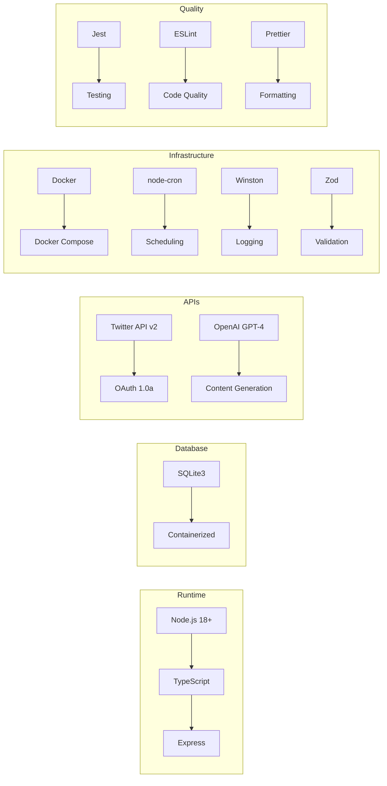

# Technology Stack

```mermaid
graph LR
    subgraph "Runtime"
        A[Node.js 18+] --> B[TypeScript]
        B --> C[Express]
    end
    
    subgraph "Database"
        D[SQLite3] --> E[Containerized]
    end
    
    subgraph "APIs"
        F[Twitter API v2] --> G[OAuth 1.0a]
        H[OpenAI GPT-4] --> I[Content Generation]
    end
    
    subgraph "Infrastructure"
        J[Docker] --> K[Docker Compose]
        L[node-cron] --> M[Scheduling]
        N[Winston] --> O[Logging]
        P[Zod] --> Q[Validation]
    end
    
    subgraph "Quality"
        R[Jest] --> S[Testing]
        T[ESLint] --> U[Code Quality]
        V[Prettier] --> W[Formatting]
    end
```
