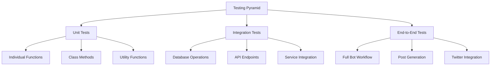

# Testing Pyramid

```mermaid
graph TB
    A[Testing Pyramid] --> B[Unit Tests]
    A --> C[Integration Tests]
    A --> D[End-to-End Tests]
    
    B --> E[Individual Functions]
    B --> F[Class Methods]
    B --> G[Utility Functions]
    
    C --> H[Database Operations]
    C --> I[API Endpoints]
    C --> J[Service Integration]
    
    D --> K[Full Bot Workflow]
    D --> L[Post Generation]
    D --> M[Twitter Integration]
```
